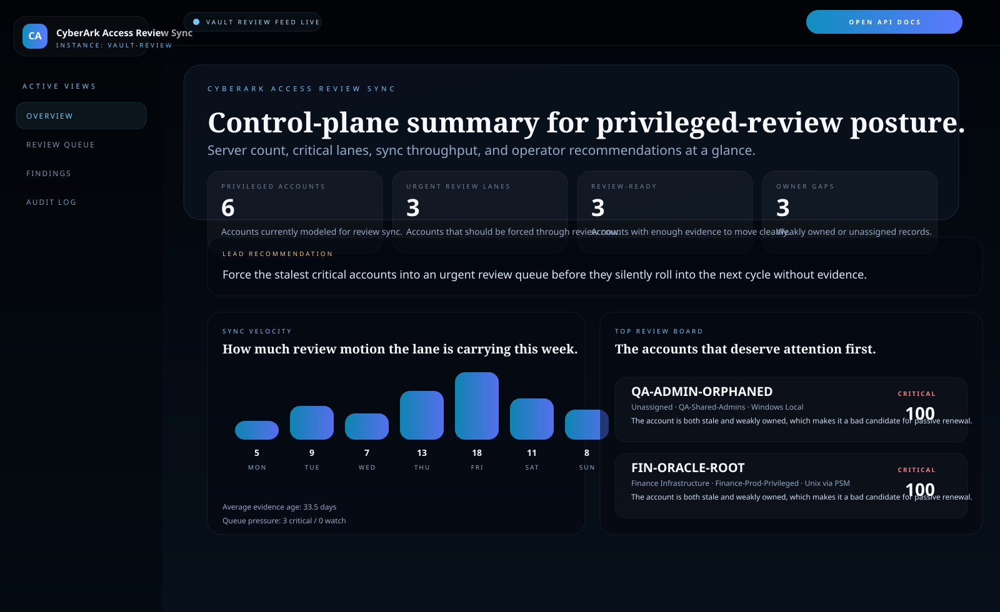
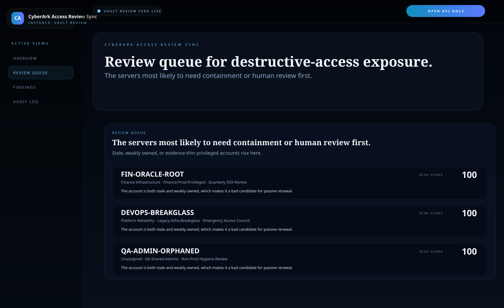
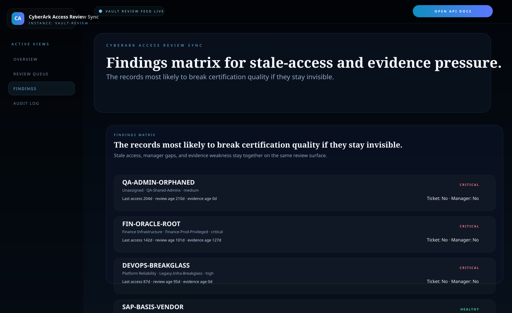
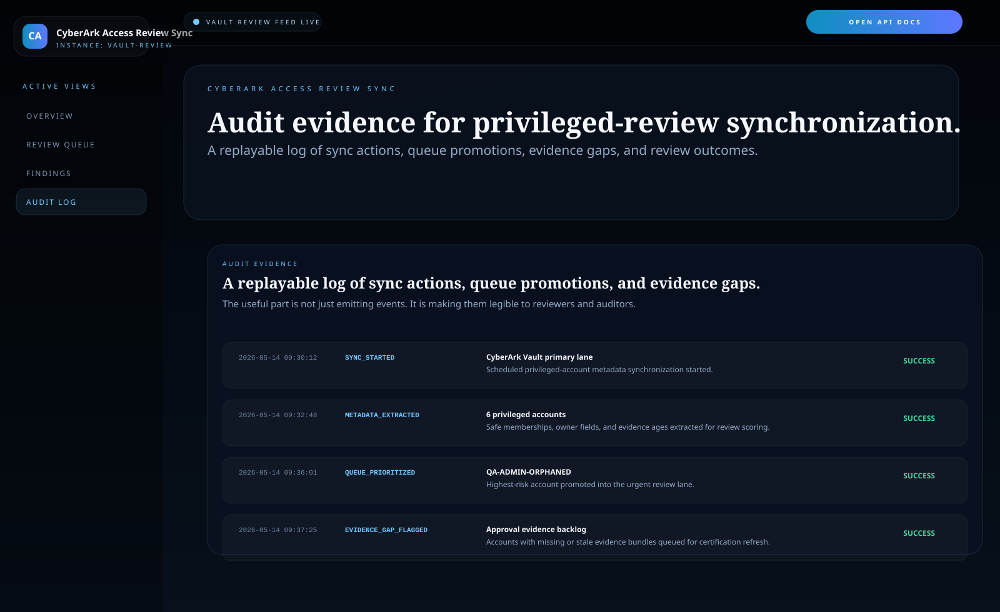

# CyberArk Access Review Sync

Python and FastAPI integration surface for **syncing CyberArk privileged-account metadata into access-review queues, stale-access findings, and approval-ready evidence payloads**.

> **What this repo proves**
>
> Privileged access reviews fail less often because the vault is missing data than because the operational record is stale, weakly owned, or missing enough evidence to defend the account in the next review cycle.

## Why this repo exists

CyberArk is usually very good at vaulting and protecting privileged access. The harder enterprise problem is what happens when review time arrives:

- which privileged accounts have gone stale without being removed
- which records are missing manager verification or current ticket evidence
- which critical accounts are still carrying privilege without a review-ready approval trail
- which queue should security or platform teams attack first instead of trying to certify everything at once

`cyberark-access-review-sync` models that review-sync layer directly. It turns privileged-account metadata into an operator-facing queue built around stale access, review age, evidence freshness, and ownership quality.

## Screenshots






## What it includes

- FastAPI service with HTML proof surfaces and JSON APIs
- seeded CyberArk-style account inventory across safes, platforms, review groups, and target systems
- risk scoring for stale access, overdue reviews, approval evidence age, and owner gaps
- urgent review queue for `watch` and `critical` accounts
- findings matrix for ticket state, manager verification, and evidence freshness
- audit-evidence surface for sync actions, queue promotions, and review-event replay
- configuration posture page for vault context, sync cadence, and downstream integration targets
- approval-ready payload examples for downstream review or governance systems
- SVG proof assets generated from the same service state
- unit tests, smoke checks, and GitHub Actions CI

## Local run

```powershell
cd cyberark-access-review-sync
py -3.11 -m venv .venv
.\.venv\Scripts\python.exe -m pip install -r requirements.txt
.\.venv\Scripts\python.exe -m app.main
```

Open:

- [http://127.0.0.1:4961/](http://127.0.0.1:4961/)
- [http://127.0.0.1:4961/review-queue](http://127.0.0.1:4961/review-queue)
- [http://127.0.0.1:4961/findings](http://127.0.0.1:4961/findings)
- [http://127.0.0.1:4961/audit-log](http://127.0.0.1:4961/audit-log)
- [http://127.0.0.1:4961/settings](http://127.0.0.1:4961/settings)
- [http://127.0.0.1:4961/methodology](http://127.0.0.1:4961/methodology)
- [http://127.0.0.1:4961/docs](http://127.0.0.1:4961/docs)

If the port is busy:

```powershell
$env:PORT = "4965"
.\.venv\Scripts\python.exe -m app.main
```

## Validation

```powershell
.\.venv\Scripts\python.exe -m unittest discover -s tests
.\.venv\Scripts\python.exe scripts\run_demo.py
.\.venv\Scripts\python.exe scripts\smoke_check.py
.\.venv\Scripts\python.exe scripts\render_readme_assets.py
```

## API routes

- `GET /api/dashboard/summary`
- `GET /api/accounts`
- `GET /api/accounts/{account_id}`
- `GET /api/reviews`
- `GET /api/findings`
- `GET /api/sample`

## Repo layout

```text
app/
  data/
  services/
docs/
scripts/
screenshots/
tests/
```
